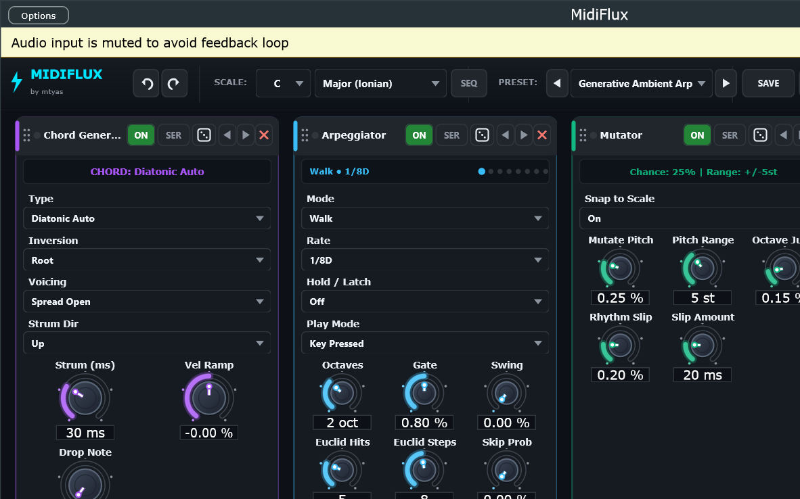

# 🎹 MidiFlux: Generative Modular MIDI Rack & Harmonic Sequencer
### Developed by **mtyas** | VST3 • CLAP • Standalone (Windows 64-bit)

[](https://isocpp.org/)
[](https://juce.com/)
[](https://github.com/free-audio/clap)
[]()
[]()

---

**MidiFlux** is an advanced modular MIDI transformation and generative sequencing environment designed by **mtyas**. Engineered as an intelligent neural layer between your keyboard/DAW and your synthesizers, MidiFlux transforms simple melodies and single-finger chords into intricate algorithmic performances, organic humanized grooves, and dynamic song-wide harmonic progressions.

Featuring **16 specialized processing blocks**, independent **Series / Parallel routing**, and a DAW-synchronized **Scale Progression Sequencer**, MidiFlux brings the expressive flexibility of a Eurorack modular MIDI system directly into modern digital audio workstations.

---

## 📸 Architecture & Interface



```
+----------------------------------------------------------------------------------------------------+
|  mtyas MidiFlux     [ PRESET: 01 - Neoclassical Arps ]   [ SCALE SEQ: ON ]   [BYPASS] [PANIC] [🎲] |
+----------------------------------------------------------------------------------------------------+
|  SCALE PROGRESSION: [ 4 Bars: C Major ] -> [ 2 Bars: A Minor ] -> [ 2 Bars: F Lydian ]   [LOOP: ON]|
+----------------------------------------------------------------------------------------------------+
|  [CHORD GENERATOR]    |  [ARPEGGIATOR]        |  [HUMANIZER]          |  [MIDI DELAY]              |
|  Type: Diatonic Auto  |  Pattern: Up/Down     |  Groove: Laid-Back    |  Time: 1/16D               |
|  Voicing: Drop-2      |  Rate: 1/16           |  Time Jitter: 15ms    |  Feedback: 4               |
|  Strum: 35ms (Alt)    |  Gate: 85%            |  Push/Pull: +10ms     |  Decay: -20% (Crescendo 2x)|
|  Routing: SERIES      |  Routing: SERIES      |  Routing: SERIES      |  Routing: PARALLEL         |
+-----------------------+-----------------------+-----------------------+----------------------------+
|  MIDI MONITOR:  IN [==  =   ===   =]  --->  OUT [==== ===== ====== === ==  ===]                    |
+----------------------------------------------------------------------------------------------------+
|  VIRTUAL KEYBOARD: [Hide/Show] [Hold Latch] [Octave: C2 - C5] [Right-Click Drag to Scroll]         |
|  [ ||| | ||| | ||| | ||| | ||| | ||| | ||| | ||| | ||| | ||| | ||| | ||| | ||| | ||| | ||| | ||| ]|
+----------------------------------------------------------------------------------------------------+
```

---

## ✨ Key Highlights

- **16 Modular Processing Blocks**:
  - **Arp & Rhythm**: Arpeggiator (with Hold & Chord Latch), Euclidean Generator, MIDI Delay (with up to +200% crescendo feedback), Ratchet / Note Rolls, Time Quantizer.
  - **Harmonic**: Diatonic Chord Generator (with realistic strumming & inversions), Harmonizer (dual-voice 3rds/5ths/octaves), Scale Quantizer.
  - **Generative**: Humanizer (pocket delay & 4 groove feel styles), Mutator (micro-interval drift), Probability Gate.
  - **Utility**: LFO / CC Modulator, Transform (pitch/velocity mirror & invert), Transpose, Key/Velocity Filter, Pitch Mapper.
- **Series & Parallel Routing**:
  - Switch any module between **Series** (daisy-chained into downstream blocks) and **Parallel** (taps raw DAW input and merges) with a single click.
- **Scale Progression Sequencer**:
  - Automate musical scale and root changes throughout your song timeline in blocks from $1/4$ bar to $16$ bars, perfectly locked to DAW playhead PPQ.
- **Interactive Full-Width Keyboard**:
  - Vertical velocity sensitivity (soft ghost notes on top, loud accents at bottom), smooth horizontal scrolling, and dedicated chord-hold mode.
- **Zero-Allocation Audio Thread**:
  - Pre-allocated scratch buffers (`ensureSize(2048)`) and pre-reserved container memory ensure zero heap allocations during real-time playback.
  - Non-blocking `std::try_to_lock` mutex architecture eliminates thread priority inversions.
- **Hardware MIDI Learn & Preset Management**:
  - Right-click MIDI CC learn on any knob/control.
  - Save, load, and edit custom presets (`.mfpreset`) and scale progressions (`.mfprog`).

---

## 📖 Complete Documentation & Marketing

- Detailed User Manual: **[`MANUAL.md`](MANUAL.md)**
- Promotional Material & Press Kit: **[`PROMO.md`](PROMO.md)**

---

## 🛠️ Building From Source

### Prerequisites:
- Windows 10 or 11 (64-bit)
- Visual Studio 2022 (MSVC C++ x64)
- CMake 3.22 or newer
- Git

### Build Instructions:
```powershell
# 1. Clone repository
git clone https://github.com/mtyas/MidiFlux.git
cd MidiFlux

# 2. Configure with CMake
cmake -B build -G "Visual Studio 17 2022" -A x64

# 3. Compile Release binaries
cmake --build build --config Release --parallel

# 4. Run automated test suite
.\build\Release\MidiFluxTests.exe
```

### Generated Binaries:
- **VST3**: `build/MidiFlux_artefacts/Release/VST3/MidiFlux.vst3`
- **CLAP**: `build/MidiFlux_artefacts/Release/CLAP/MidiFlux.clap`
- **Standalone**: `build/MidiFlux_artefacts/Release/Standalone/MidiFlux.exe`

---

## 📄 License & Attribution

Developed by **mtyas**. Built with the JUCE 8 Framework and clap-juce-extensions. All rights reserved.
