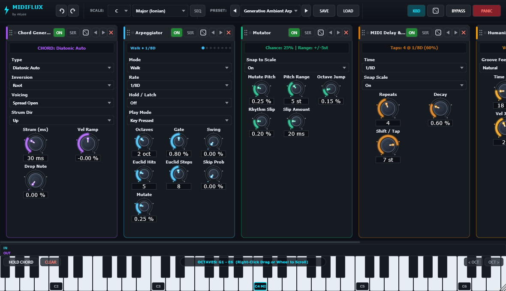
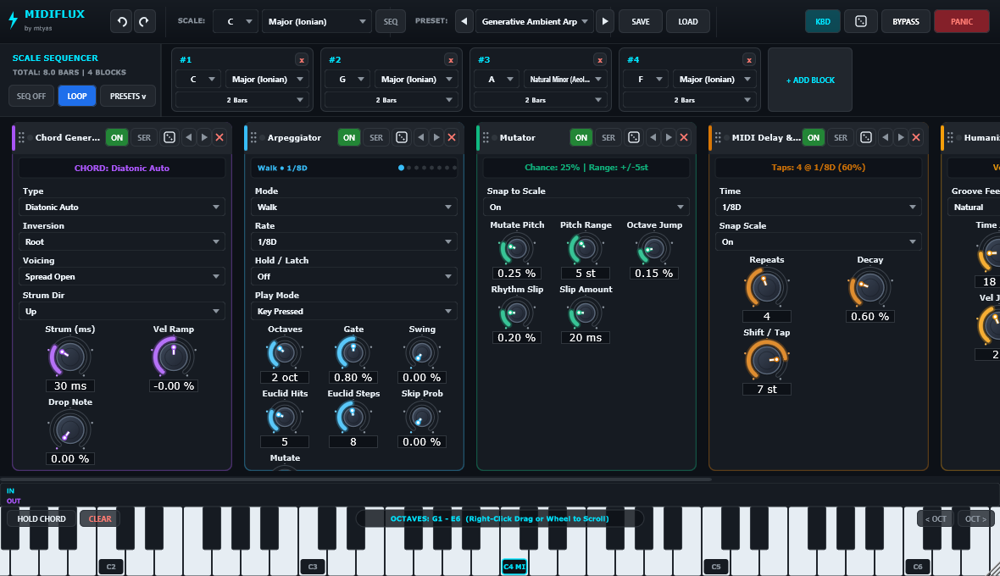
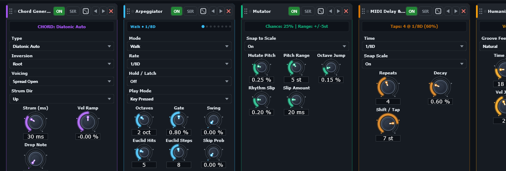
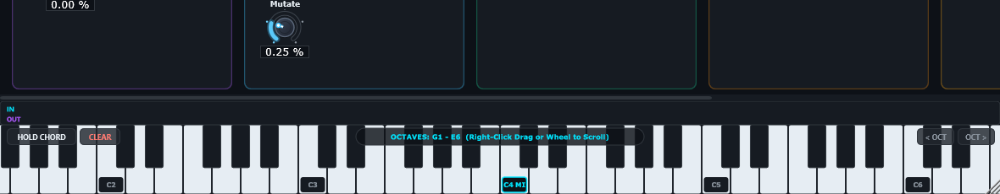
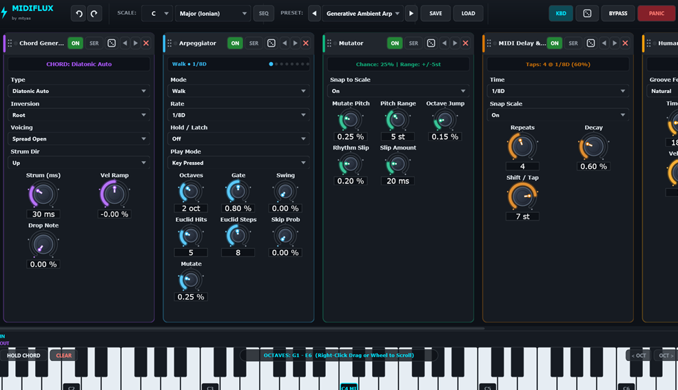

# 🎹 MidiFlux: Generative Modular MIDI Rack & Harmonic Sequencer
### Developed by **mtyas** | VST3 • CLAP • AU • Standalone (Windows / macOS / Linux)

[](https://github.com/mtyas/MidiFlux/releases/latest)
[](MANUAL.md#modular-blocks)
[](https://github.com/free-audio/clap)
[]()
[](https://ko-fi.com/mtyas)

---

> ### ⚡ Quick Action & Links
> - [📥 **Download Latest Binaries (Windows / macOS / Linux)**](https://github.com/mtyas/MidiFlux/releases/latest)
> - [📖 **Read Full User Manual (`MANUAL.md`)**](MANUAL.md)
> - [🎛️ **Studio Ecosystem Routing (Pairs Well With)**](#-pairs-well-with-studio-ecosystem-synergy)
> - [🧱 **16 Modular Processing Blocks**](#-16-modular-processing-blocks)

---

## 🎼 Creative Vision & Overview

**MidiFlux** is the **algorithmic brain** for your studio. Functioning as an intelligent neural bridge between your keyboard/DAW and your synthesizers, MidiFlux transforms simple melodies and single-finger chords into intricate polyphonic arpeggios, humanized organic grooves, and song-wide harmonic progressions.

Instead of writing static piano roll notes by hand, MidiFlux provides a virtual Eurorack-style modular rack with **16 specialized processing blocks**. Stack chord generators, euclidean rhythm engines, probability gates, crescendo delays, and groove humanizers with instant **Series / Parallel routing**. Combined with an integrated, DAW-synchronized **Scale Progression Sequencer**, MidiFlux ensures that your hardware and software synthesizers remain locked in perfect harmonic synchronization while breathing with organic micro-timing variations.

---

## 📸 Interface & Visual Tour

<p align="center">
  
</p>

### 🔍 Detailed Interface Breakdown

| DAW-Synced Scale Progression Sequencer | Eurorack-Style Modular Processing Blocks |
| :---: | :---: |
|  |  |
| *Automate dynamic musical scale changes (C Major $\to$ A Minor $\to$ F Lydian) across song measures, locked to host timeline PPQ.* | *Drag-and-drop modular cards with independent bypass, Series/Parallel routing, and dynamic parameter randomization.* |

| Virtual Keyboard & Real-Time MIDI Monitor | Live Performance Stream |
| :---: | :---: |
|  |  |
| *88-key velocity-sensitive virtual keyboard with chord latch, alongside real-time input vs algorithmic output activity meters.* | *Compact high-density studio layout designed for seamless integration inside modern DAW instrument tracks.* |

---

## 🌟 Innovation Spotlight: Standout Breakthroughs

> [!IMPORTANT]
> ### 🎼 DAW-Synchronized Scale Progression Sequencer
> Traditional scale quantizers force your entire song into a single static scale. MidiFlux introduces an **Arrangement-Aware Scale Progression Timeline**:
> - Construct harmonic chord progressions across bars ($1/4$ bar to $16$ bars per step).
> - Perfectly synchronized to your DAW transport and PPQ playhead position.
> - As your song enters the chorus or bridge, MidiFlux automatically modulates the active key and scale across all downstream synthesizers, keeping your entire track in effortless harmonic cohesion.

> [!TIP]
> ### 🎛️ Independent Series & Parallel Modular Routing
> In a hardware Eurorack rig, multing and parallel routing require patch cables and mixer modules. In MidiFlux, every single block features an instant **Series / Parallel toggle**:
> - **Series Mode**: The block processes the output of the preceding block in the rack.
> - **Parallel Mode**: The block taps the raw, unadulterated incoming MIDI performance from your DAW/keyboard and merges its processed output into the downstream stream—ideal for parallel arpeggios, delay tap layers, and layered octave harmonies.

---

## 🎛️ Pairs Well With: Studio Ecosystem Synergy

MidiFlux acts as the central conductor for the **MTYAS Audio Suite**, breathing life into physical models and synthesizers:

```
               +--------------------------------------+
               |          MidiFlux (Sequencer)        |
               | - Algorithmic chord progressions     |
               | - Humanized micro-timing variations  |
               | - Dynamic velocity curves            |
               +---+------------------+---------------+
                   |                  |
    MIDI Note &    |                  |  Polyrhythmic
    Micro-Timing   |                  |  MIDI Triggers
                   v                  v
         +-----------------+  +-----------------+
         | TopModel (Phys) |  | FORGE64 (Drums) |
         | Acoustic bodies |  | 64-pad kits &   |
         | & collisions    |  | Lua DSP scripts |
         +--------+--------+  +--------+--------+
                  |                    |
                  | Audio              | Audio
                  v                    v
         +--------------------------------------+
         |          OmniSplit (Audio FX)        |
         | - Multi-domain surgical processing   |
         +--------------------------------------+
```

### 1. 🎻 MidiFlux $\to$ TopModel (The Algorithmic Brain Feeding the Physical Body)
- **Why It Pairs**: Physical modeling synthesizers respond to velocity and timing variations **exponentially better than static sample players**. A static MIDI note sequence creates monotonous acoustic excitation. But when notes hit a virtual string with subtle micro-timing variations and nuanced velocities, the mathematical collision friction changes on every single strike.
- **Workflow**: Route MidiFlux into **TopModel**. Engage MidiFlux's **Humanizer** block (with subtle time jitter $\pm 8\text{ms}$ and velocity drift) and the **Scale Progression Sequencer**. The micro-timing offsets alter hammer contact duration, excitation position, and rosin friction in real time, yielding an organic, breathing acoustic performance that sounds like a living musician.

### 2. 🎛️ MidiFlux $\to$ CrossMod (Polyphonic Voice Coupling)
- **Why It Pairs**: CrossMod features inter-voice modulation topologies (*Root Driver*, *Cyclic Ring*) where voices modulate each other based on note pitch and order.
- **Workflow**: Route MidiFlux into **CrossMod**. Use MidiFlux's **Diatonic Chord Generator** and **Arpeggiator** to feed complex chord voicings into CrossMod's X-Voice matrix, triggering shimmering harmonic sidebands and responsive analog ladder filter sweeps.

### 3. 🥁 MidiFlux $\to$ FORGE64 (Procedural Polyrhythms)
- **Why It Pairs**: FORGE64's 64 drum pads thrive on generative polyrhythms.
- **Workflow**: Connect MidiFlux to **FORGE64**. Use MidiFlux's **Euclidean Block** and **Ratchet Block** to generate hypnotic African and Latin polyrhythms, driving custom real-time Lua DSP drum engines.

---

## 🧱 16 Modular Processing Blocks

MidiFlux includes 16 specialized modules that can be arranged in any order:

1. **Chord Generator**: Diatonic chord generator with drop-2, drop-3 voicings, inversions, and customizable strum delay.
2. **Arpeggiator**: 8 directional patterns, octave ranges (1–4), note repeat, and chord-hold latch.
3. **Euclidean Generator**: Algorithmic mathematical Euclidean rhythm generator ($K$ hits over $N$ steps).
4. **Humanizer**: Micro-timing push/pull (-50% to +50%), random millisecond time jitter, and velocity humanization.
5. **Mutator**: Generative pitch and velocity mutation with controlled probability.
6. **Probability Gate**: Stochastic note passing with velocity scaling.
7. **Scale Quantizer**: Quantizes incoming chromatic notes to 24 musical scales and modes.
8. **Time Quantizer**: Rhythmic grid snapping with adjustable swing and strength.
9. **Transpose**: Octave and semitone shifting with optional scale snap.
10. **MIDI Delay**: Tempo-synchronized delay taps with up to **+200% crescendo feedback**.
11. **Ratchet / Note Rolls**: High-speed burst subdivisions (2x to 8x) for trap rolls and glitch fills.
12. **Harmonizer**: Dual-voice pitch harmonizer (3rds, 5ths, 7ths, octaves).
13. **Key & Velocity Filter**: Splits keyboard ranges and velocity layers.
14. **Transform**: Bipolar pitch and velocity mirror/inversion.
15. **LFO / CC Modulator**: Tempo-synced MIDI CC modulation with 6 waveforms.
16. **Pitch Mapper**: Custom arbitrary note-to-note mapping table.

---

## 📦 Downloads & Installation

Pre-compiled production releases for Windows, macOS, and Linux are available from the [**Releases Page**](https://github.com/mtyas/MidiFlux/releases/latest):

| OS / Platform | Download Package | Included Formats | Architecture |
| :--- | :--- | :--- | :--- |
| **Windows** | [📥 **MidiFlux-v1.0.0-Windows.zip**](https://github.com/mtyas/MidiFlux/releases/download/v1.0.0/MidiFlux-v1.0.0-Windows.zip) | VST3, CLAP, Standalone (`MidiFlux.exe`) | x86_64 |
| **macOS** | [📥 **MidiFlux-v1.0.0-macOS-Universal.zip**](https://github.com/mtyas/MidiFlux/releases/download/v1.0.0/MidiFlux-v1.0.0-macOS-Universal.zip) | VST3, CLAP, AudioUnit (`.component`), Standalone (`MidiFlux.app`) | Universal (Apple Silicon & Intel) |
| **Linux** | [📥 **MidiFlux-v1.0.0-Linux-x64.zip**](https://github.com/mtyas/MidiFlux/releases/download/v1.0.0/MidiFlux-v1.0.0-Linux-x64.zip) | VST3, CLAP, Standalone | x86_64 |

---

## ⚙️ Architecture & Engineering Specifications

- **C++20 & JUCE 8 Framework**: Modern vectorized standard library.
- **Zero-Allocation Audio Thread**: Pre-allocated scratch buffers (`ensureSize(2048)`) and pre-reserved containers guarantee zero heap allocations during playback.
- **Lock-Free Thread Safety**: Non-blocking `std::try_to_lock` mutex architecture ensures zero thread priority inversions.
- **Full Hardware MIDI Learn**: Right-click any control to bind to physical MIDI CC knobs and faders.

### Building from Source

```bash
git clone --recursive https://github.com/mtyas/MidiFlux.git
cd MidiFlux
cmake -B build -DCMAKE_BUILD_TYPE=Release
cmake --build build --config Release --target MidiFlux_All
```

---

## ☕ Support & Community

If MidiFlux empowers your productions, please consider supporting ongoing development:

[](https://ko-fi.com/mtyas)

---

## 📄 License

Copyright © 2026 **mtyas**. All rights reserved.  
Crafted with [JUCE](https://juce.com) and [CLAP Extensions](https://github.com/free-audio/clap).